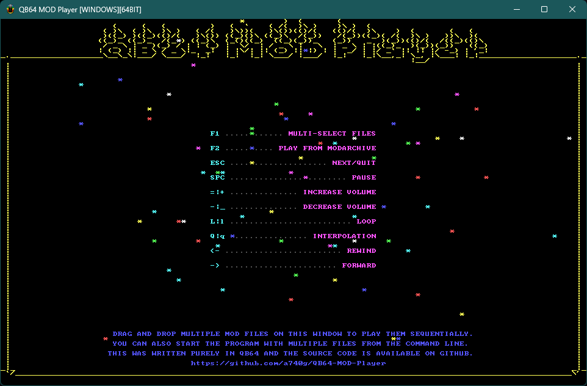
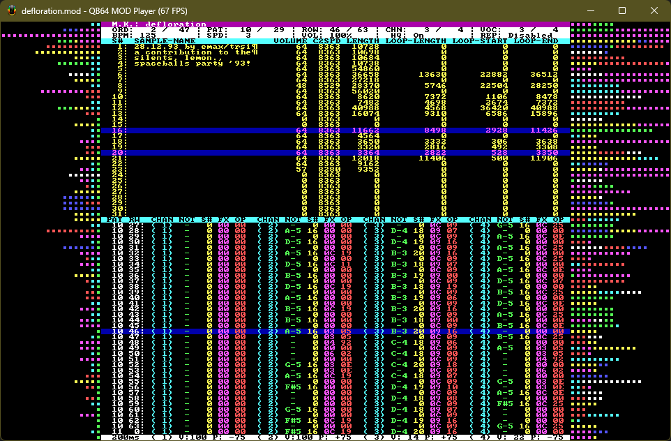

# QB64 MOD PLAYER

This is a [MOD](https://en.wikipedia.org/wiki/MOD_(file_format)) player and library written in [QB64-PE](https://github.com/QB64-Phoenix-Edition/QB64pe).

It currently supports the following formats:

- [ProTracker](https://en.wikipedia.org/wiki/ProTracker) (and compatible)
- [MultiTracker](https://en.wikipedia.org/wiki/Module_file#Popular_formats)

---




## FEATURES

- No dependency on third party libraries
- Everything is statically linked (no shared library dependency)
- Easy plug-&-play API optimized for demos & games
- Cross-platform (works on Windows, Linux & macOS)
- Support all MOD types (1 - 99 channels, 31 samples etc.)
- Support all MOD effects
- Demo player that shows how to use the library

## USAGE

- Clone the repository to a directory of your choice
- Open Terminal and change to the directory using an appropriate OS command
- Run `git submodule update --init --recursive` to initialize, fetch and checkout git submodules
- Open *QB64MODPlayer.bas* in the QB64-PE IDE and press `F5` to compile and run
- To use the library in your project add the [Toolbox64](https://github.com/a740g/Toolbox64) repositiory as a [Git submodule](https://git-scm.com/book/en/v2/Git-Tools-Submodules)

## API

```VB
' Main Player API
FUNCTION MODPlayer_LoadFromMemory%% (buffer AS STRING)
FUNCTION MODPlayer_LoadFromDisk%% (fileName AS STRING)
FUNCTION MODPlayer_GetName$
FUNCTION MODPlayer_GetType$
SUB MODPlayer_Play
FUNCTION MODPlayer_IsPlaying%%
SUB MODPlayer_Pause (state AS _BYTE)
FUNCTION MODPlayer_IsPaused%%
SUB MODPlayer_Loop (state AS _BYTE)
FUNCTION MODPlayer_IsLooping%%
SUB MODPlayer_GoToNextPosition
SUB MODPlayer_GoToPreviousPosition
SUB MODPlayer_SetPosition (position AS INTEGER)
FUNCTION MODPlayer_GetPosition%
FUNCTION MODPlayer_GetOrders%
SUB MODPlayer_Stop
SUB MODPlayer_Update
' Sample Mixer API (used internally by the Player)
SUB SampleMixer_Initialize (nVoices AS _UNSIGNED _BYTE)
SUB SampleMixer_Finalize
FUNCTION SampleMixer_IsInitialized%%
FUNCTION SampleMixer_NeedsUpdate%%
SUB SampleMixer_Update (nSamples AS _UNSIGNED INTEGER)
SUB SampleMixer_SetVoiceVolume (nVoice AS _UNSIGNED _BYTE, nVolume AS SINGLE)
FUNCTION SampleMixer_GetVoiceVolume! (nVoice AS _UNSIGNED _BYTE)
SUB SampleMixer_SetVoicePanning (nVoice AS _UNSIGNED _BYTE, nPanning AS SINGLE)
FUNCTION SampleMixer_GetVoicePanning! (nVoice AS _UNSIGNED _BYTE)
SUB SampleMixer_SetVoiceFrequency (nVoice AS _UNSIGNED _BYTE, nFrequency AS SINGLE)
SUB SampleMixer_StopVoice (nVoice AS _UNSIGNED _BYTE)
SUB SampleMixer_PlayVoice (nVoice AS _UNSIGNED _BYTE, nSample AS _UNSIGNED _BYTE, nPosition AS SINGLE, nPlayType AS _UNSIGNED _BYTE, nStart AS SINGLE, nEnd AS SINGLE)
' Sample Mixer API (user callable)
SUB SampleMixer_SetGlobalVolume (nVolume AS SINGLE)
FUNCTION SampleMixer_GetGlobalVolume!
SUB SampleMixer_SetHighQuality (nFlag AS _BYTE)
FUNCTION SampleMixer_IsHighQuality%%
FUNCTION SampleMixer_GetSampleRate&
FUNCTION SampleMixer_GetBufferedSoundTime#
FUNCTION SampleMixer_GetTotalSamples~%%
FUNCTION SampleMixer_GetTotalVoices~%%
FUNCTION SampleMixer_GetActiveVoices~%%
' Sample Manager API (used internally by the Player)
SUB SampleManager_Initialize (nSamples AS _UNSIGNED _BYTE)
SUB SampleManager_Load (nSample AS _UNSIGNED _BYTE, sData AS STRING, nSampleFrameSize AS _UNSIGNED _BYTE, isLooping AS _BYTE, nLoopStart AS LONG, nLoopEnd AS LONG)
FUNCTION SampleManager_PeekByte%% (nSample AS _UNSIGNED _BYTE, nPosition AS LONG)
SUB SampleManager_PokeByte (nSample AS _UNSIGNED _BYTE, nPosition AS LONG, nValue AS _BYTE)
FUNCTION SampleManager_PeekInteger% (nSample AS _UNSIGNED _BYTE, nPosition AS LONG)
SUB SampleManager_PokeInteger (nSample AS _UNSIGNED _BYTE, nPosition AS LONG, nValue AS INTEGER)
FUNCTION SampleManager_PeekSingle! (nSample AS _UNSIGNED _BYTE, nPosition AS LONG)
SUB SampleManager_PokeSingle (nSample AS _UNSIGNED _BYTE, nPosition AS LONG, nValue AS SINGLE)
```

## FAQ

Why a MOD player in QB64?

- Just for learning and fun! Long answer: I have seen plenty of MOD players code and libraries in C & C++ but very little in other languages. I know about some JavaScript, Java and C# ones. But, I am not a fan of those languages. I learnt to code on DOS using QuickBASIC and then graduated to C & C++. So, QuickBASIC always had a special place in my heart. Then, I found QB64 on the internet and the rest is history. As far as I know this is the first of it's kind. Let me know if there are any other MOD players written in pure QB64.

Can you implment feature x / y?

- With the limited time I have between my day job, home and family, there is only so much I can do. I do maintain a list of TODO (see below). However, those do not have any set deadlines. If you need something implemented, submit a GitHub issue about it or do it yourself and submit a PR.

I found a bug. How can I help?

- Let me know using GitHub issues or fix it yourself and submit a PR!

Can this be used in a game / demo?

- Absolutely. The player UI code included in a great example.

You keep saying QB64-PE with miniaudio backend. Where is it?

- Glad you asked! IT, XM, S3M & MOD support is built into [QB64-PE v3.1.0+](https://github.com/QB64-Phoenix-Edition/QB64pe/releases/).

I see that the miniaudio backend version of QB64-PE already has MOD, S3M, XM, IT, RADv2 & MIDI support. Why should I care about this?

- Honestly, you should not! The MOD re-player in QB64-PE with miniaudio backend uses [Libxmp-lite](https://github.com/libxmp/libxmp/tree/master/lite) and as such is good enough for most use cases. This is just something that I made just to see what can be done using just QB64-PE. If you want to see what MOD files are made of and what makes them tick, then by all means, have at it. There are some interesting things in the code for people who care about this kind of stuff. Also, my MOD re-player is more accurate than the one in Libxmp-lite... I hope. 😉

## NOTES

- This requires the latest version of [QB64-PE](https://github.com/QB64-Phoenix-Edition/QB64pe/releases)
- When you clone a repository that contains submodules, the submodules are not automatically cloned by default
- You will need to use the `git submodule update --init --recursive` to initialize, fetch and checkout git submodules

## BIBLIOGRAPHY

- [MOD Player Tutorial](docs/FMODDOC.TXT) by FireLight
- [S3M Player Tutorial](docs/FS3MDOC.TXT) by FireLight
- [Noisetracker/Soundtracker/Protracker Module Format](docs/MOD-FORM.TXT) by Andrew Scott
- [MODFIL10.TXT](docs/MODFIL10.TXT) by Thunder
- [Protracker Module](https://wiki.multimedia.cx/index.php/Protracker_Module) from MultimediaWiki
- [MOD Effect Commands](https://wiki.openmpt.org/Manual:_Effect_Reference#MOD_Effect_Commands) from OpenMPT Wiki
- [MultiTracker Module (MTM) Format](docs/MultiTracker%20(.mtm).txt) by Renaissance
- [Digital Audio Mixing Techniques](docs/FSBDOC.TXT) by jedi / oxygen
- [Writing Mixing Routines](docs/MIXING10.TXT) by BYTERAVER/TNT
- [Audio Mixer Tutorial](https://github.com/benhenshaw/mixer_tutorial) by benhenshaw

## ASSETS

- [Icon](https://iconarchive.com/artist/tsukasa-tux.html) by Tsukasa-Tux (Azrael Jackie Lockheart)

## TODO

- STM loader
- S3M loader (with OPL3 emulation)
