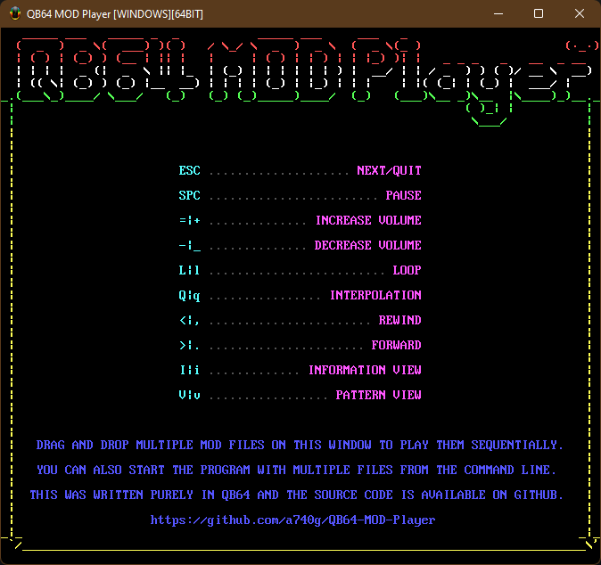
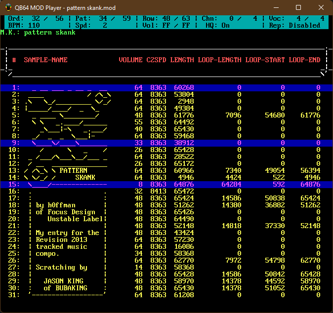
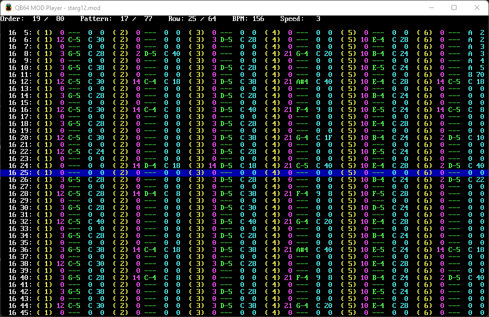

# QB64 MOD Player

A [ProTracker](https://en.wikipedia.org/wiki/ProTracker) (and compatible) [MOD](https://en.wikipedia.org/wiki/MOD_(file_format)) player library written entirely in [QB64](https://github.com/QB64-Phoenix-Edition/QB64pe).





## Goals

- No dependency on third party libraries - OK
- No OS specific code in the Loader, Player & Mixer - OK
- Support all MOD types (1 - 99 channels, 31 samples etc.) - OK
- Support all MOD effects - WIP (2 remaining; E3 & EF)
- Easy plug-&-play API - OK
- Play all the test MODs in the repository correctly - WIP (dope.mod sounds awful I think XD)
- Survive ode2ptk.mod & black_queen.mod - OK
- Include a demo player to show how to use the library - OK

## API

```VB
Function LoadMODFile` (sFileName As String)
Sub StartMODPlayer
Sub StopMODPlayer
```

## Bibliography

- [MOD Player Tutorial](docs/FMODDOC.TXT) by FireLight
- [S3M Player Tutorial](docs/FS3MDOC.TXT) by FireLight
- [Noisetracker/Soundtracker/Protracker Module Format](docs/MOD-FORM.TXT) by Andrew Scott
- [MODFIL10.TXT](docs/MODFIL10.TXT) by Thunder
- [Protracker Module](https://wiki.multimedia.cx/index.php/Protracker_Module) by MultimediaWiki
- [Digital Audio Mixing Techniques](docs/FSBDOC.TXT) by jedi / oxygen
- [Writing Mixing Routines](docs/MIXING10.TXT) by BYTERAVER/TNT
- [Audio Mixer Tutorial](https://github.com/benhenshaw/mixer_tutorial) by benhenshaw

## Assets

- [Icon](https://iconarchive.com/artist/tsukasa-tux.html) by Tsukasa-Tux (Azrael Jackie Lockheart)

## FAQ

Why a MOD player in QB64?

    Just for learning and fun!

Will you add S3M, XM, IT support?

    Not sure. Probably. But you are free to fork and do it yourself.

I found a bug. How can I help?

    There are probably many bugs now. Let me know using GitHub issues.

Can this be used in a game / demo?

    Absolutely. With little effort. But I have not tried integrating this into anything myself (yet).
