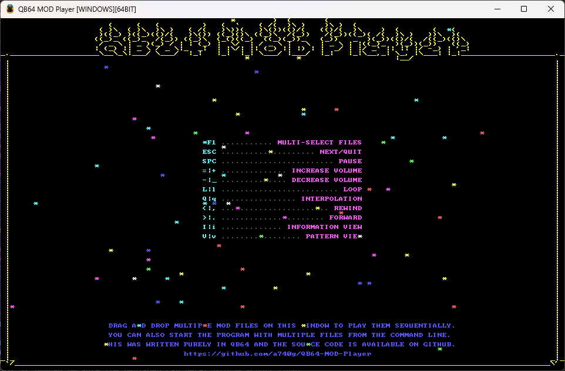
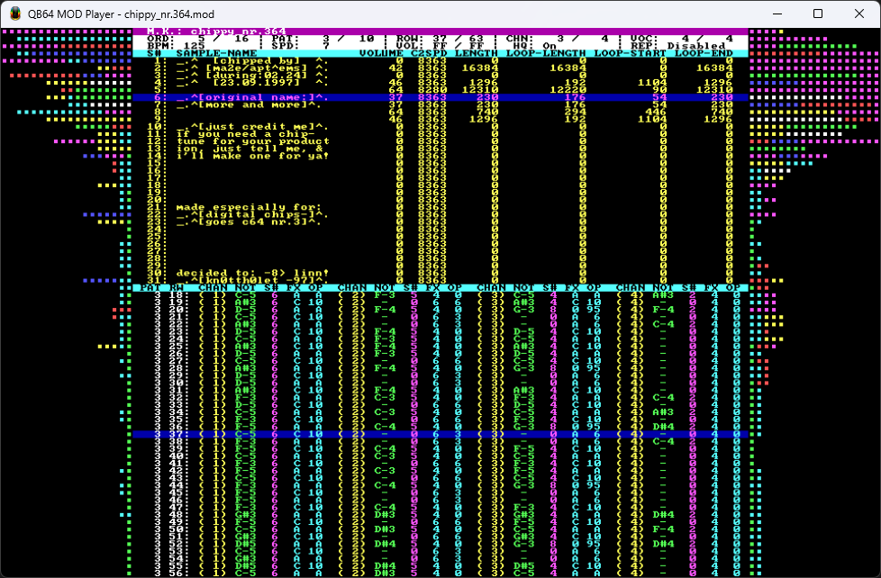

# What is this?

This is a [ProTracker](https://en.wikipedia.org/wiki/ProTracker) (and compatible) [MOD](https://en.wikipedia.org/wiki/MOD_(file_format)) player library written in [QB64-PE](https://github.com/QB64-Phoenix-Edition/QB64pe).

[](screenshots/qb64mp_demo.mp4)
[](screenshots/qb64mp_demo.mp4)

## Goals

- No dependency on third party libraries - OK
- No OS specific code in the Loader, Player & Mixer - OK
- Support all MOD types (1 - 99 channels, 31 samples etc.) - OK
- Support all MOD effects - OK
- Easy plug-&-play API - OK
- Play all the test MODs in the repository correctly - OK
- Survive ode2ptk.mod & black_queen.mod - OK
- Include a demo player to show how to use the library - OK

## API

```VB
Function LoadMODFile%% (sFileName As String)
Sub StartMODPlayer
Sub UpdateMODPlayer
Sub StopMODPlayer
Sub SetGlobalVolume (nVolume As Single)
Sub EnableHQMixer (nFlag As Byte)
```

## Bibliography

- [MOD Player Tutorial](docs/FMODDOC.TXT) by FireLight
- [S3M Player Tutorial](docs/FS3MDOC.TXT) by FireLight
- [Noisetracker/Soundtracker/Protracker Module Format](docs/MOD-FORM.TXT) by Andrew Scott
- [MODFIL10.TXT](docs/MODFIL10.TXT) by Thunder
- [Protracker Module](https://wiki.multimedia.cx/index.php/Protracker_Module) from MultimediaWiki
- [MOD Effect Commands](https://wiki.openmpt.org/Manual:_Effect_Reference#MOD_Effect_Commands) from OpenMPT Wiki
- [Digital Audio Mixing Techniques](docs/FSBDOC.TXT) by jedi / oxygen
- [Writing Mixing Routines](docs/MIXING10.TXT) by BYTERAVER/TNT
- [Audio Mixer Tutorial](https://github.com/benhenshaw/mixer_tutorial) by benhenshaw

## Assets

- [Icon](https://iconarchive.com/artist/tsukasa-tux.html) by Tsukasa-Tux (Azrael Jackie Lockheart)

## Important note

This requires the latest version of [QB64-PE](https://github.com/QB64-Phoenix-Edition/QB64pe/releases).

## FAQ

Why a MOD player in QB64?

- Just for learning and fun! Long answer: I have seen plenty of MOD players code and libraries in C & C++ but very little in other languages. I know about some JavaScript, Java and C# ones. But, I am not a fan of those languages. I learnt to code on DOS using QuickBASIC and then graduated to C & C++. So, QuickBASIC always had a special place in my heart. Then, I found QB64 on the internet and the rest is history. As far as I know this is the first of it's kind. Let me know if there are any other MOD players written in pure QB64.

Can you implment feature x / y?

- With the limited time I have between my day job, home and family, there is only so much I can do. I do maintain a list of TODO (see below). However, those do not have any set deadlines. If you need something implemented, submit a GitHub issue about it or do it yourself and submit a PR.

I found a bug. How can I help?

- Let me know using GitHub issues or fix it yourself and submit a PR!

Can this be used in a game / demo?

- Absolutely. The player UI code included in a great example.

You keep saying QB64-PE with miniaudio backend. Where is it?

- Glad you asked! IT, XM, S3M & MOD support is built into [QB64-PE v3.1.0+](https://github.com/QB64-Phoenix-Edition/QB64pe/releases/).

I see that the miniaudio backend version of QB64-PE already has MOD, S3M, XM, IT, RADv2 & MIDI support. Why should I care about this?

- Honestly, you should not! The MOD re-player in QB64-PE with miniaudio backend uses [Libxmp-lite](https://github.com/libxmp/libxmp/tree/master/lite) and as such is good enough for most use cases. This is just something that I made just to see what can be done using just QB64-PE. If you want to see what MOD files are made of and what makes them tick, then by all means, have at it. There are some interesting things in the code for people who care about this kind of stuff. Also, my MOD re-player is more accurate than the one in Libxmp-lite... I hope. 😉

## TODO

- Mixer volume ramping
- OKT loader
- MTM loader
- MED loader
- FAR loader
- 669 loader
- STM loader
- AHX loader (with proper PSG support)
- S3M loader (with proper FMS support)
- XM loader
